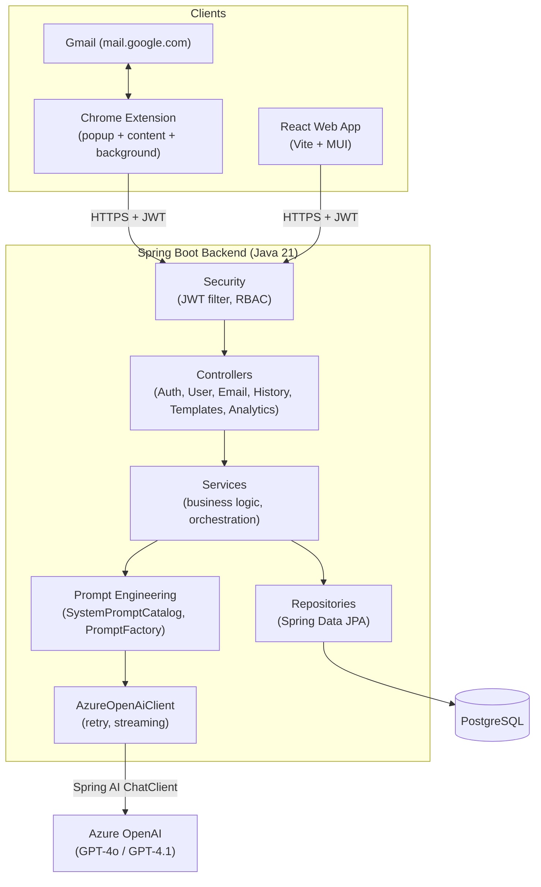

# Architecture

## System Overview



## Layered Backend Architecture

Each package has exactly one responsibility, and dependencies point inward:

```
controller  →  service  →  repository  →  entity
                 │
                 ├──► mapper (entity ↔ DTO, MapStruct)
                 ├──► prompt (system prompt catalog + prompt templating)
                 ├──► client (Azure OpenAI wrapper: retry, streaming)
                 ├──► logging (AuditLogRecorder, UsageAnalyticsRecorder)
                 └──► security (JWT issuing/validation, RBAC)

exception   →  cross-cutting: GlobalExceptionHandler + domain exceptions
validation  →  cross-cutting: custom Bean Validation constraints
config      →  cross-cutting: CORS, OpenAPI, ChatClient, typed @ConfigurationProperties
```

- **Controllers** are thin: validate input (`@Valid`), delegate to a service, wrap the result in the shared `ApiResponse<T>` envelope.
- **Services** own transactions (`@Transactional`) and orchestrate repositories, the prompt layer, and the AI client. No service ever talks to Azure OpenAI directly — always through `AzureOpenAiClient`.
- **Repositories** are Spring Data JPA interfaces; custom queries (JPQL) live here, never as raw SQL scattered through services.
- **Entities** map 1:1 to the 8 PostgreSQL tables (see [`er-diagram.md`](er-diagram.md)).

## Why a Separate `client` / `prompt` Split

Prompt engineering (what to say to the model) and AI client resilience (how to talk to Azure OpenAI reliably) are different concerns that change for different reasons — a prompt-wording tweak should never risk touching retry logic, and a retry-policy change should never risk touching prompt wording. `PromptFactory` produces a `PreparedPrompt` (system + user text); `AzureOpenAiClient` only ever consumes that value object, with no awareness of *why* the prompt says what it says.

## Security Model

Stateless JWT authentication (Module 4): a 15-minute access token is validated on every request by a custom `OncePerRequestFilter`; a 7-day refresh token (also a signed JWT, distinguished by a `type` claim) is exchanged for a new pair via `POST /api/auth/refresh`. Both the React app and the Chrome extension implement the same "single in-flight refresh, queue concurrent requests" pattern on top of this.

## Cross-Cutting Concerns

- **Exception handling**: one `@RestControllerAdvice` (`GlobalExceptionHandler`) maps every domain exception to the right HTTP status and the shared `ApiResponse` error shape. Security-layer failures (401/403) are handled separately by Spring Security's own entry point/access-denied handler, since they occur before a controller is ever reached.
- **Auditing**: `AuditLogRecorder` and `UsageAnalyticsRecorder` both write in a transaction independent from the operation they're recording, so a failed AI call still produces a usable analytics/audit trail.
