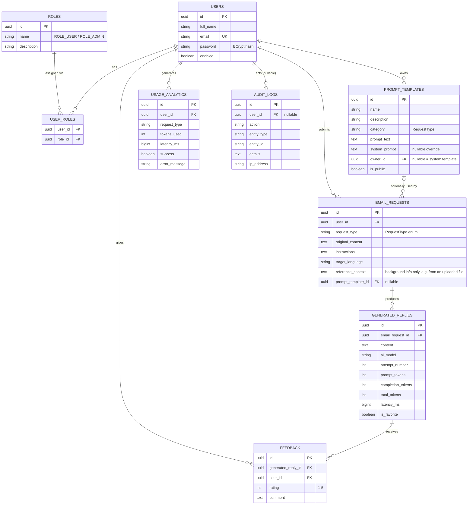

# Entity-Relationship Diagram

All primary keys are UUIDs (`GenerationType.UUID`), and every table has `created_at`/`updated_at` audit columns via Spring Data JPA auditing (omitted below for readability).

## Notable Design Decisions

- **`GeneratedReply` is many-to-one with `EmailRequest`, not one-to-one.** Reply Regeneration inserts a new row with an incremented `attempt_number` rather than overwriting the previous reply — full history is preserved, and `GET /api/history` returns every attempt.
- **`PromptTemplate.owner_id` is nullable.** A `null` owner (reserved for a future system/seed user) combined with `is_public = true` marks a template visible to everyone; a template with an owner and `is_public = false` is private to that user only.
- **`UsageAnalytics` is independent of `EmailRequest`**, not derived from it. It's written even when the AI call fails (with `success = false` and an `error_message`), and it survives if the originating `EmailRequest` is later deleted via `DELETE /api/history/{id}` (no FK from `UsageAnalytics` back to `EmailRequest`).
- **`AuditLog.user_id` is nullable** to support logging unauthenticated/system events (e.g. a failed login attempt against a real user id, or a future system-initiated action).
- **No `Feedback` REST endpoint currently exists** (see [`future-enhancements.md`](future-enhancements.md)) — the table and repository are in place, ready for a `POST /api/history/replies/{id}/feedback` endpoint.
