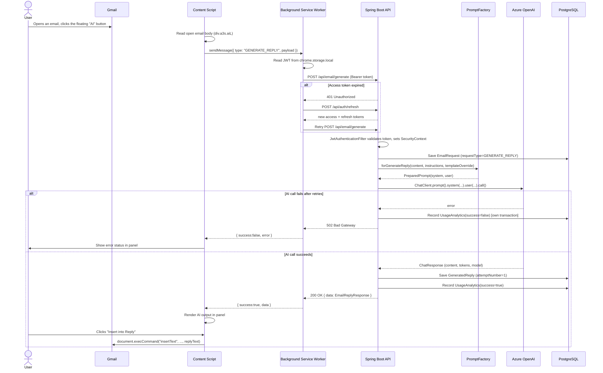
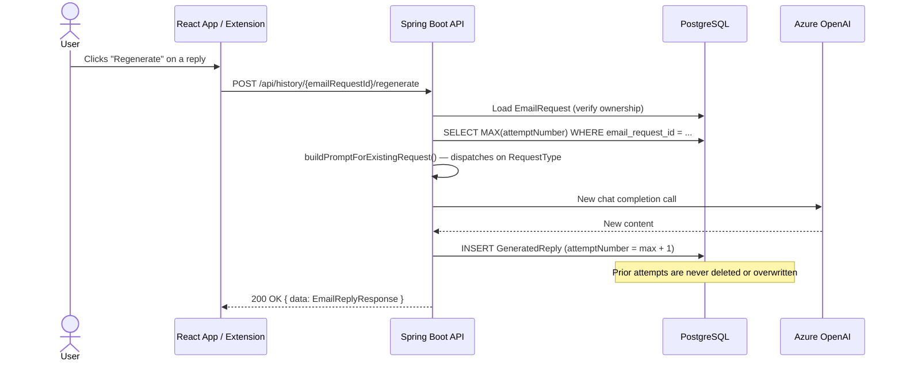

# Sequence Diagram — AI Reply Generation (Gmail → Extension → Backend → Azure OpenAI)

This is the flow described in the original application spec: a user reads an email in Gmail, clicks the extension's AI button, and the generated reply is inserted back into the compose box.

## Reply Regeneration Flow

Regeneration re-derives the *same* prompt from the persisted `EmailRequest` rather than requiring the client to resend the original payload:

